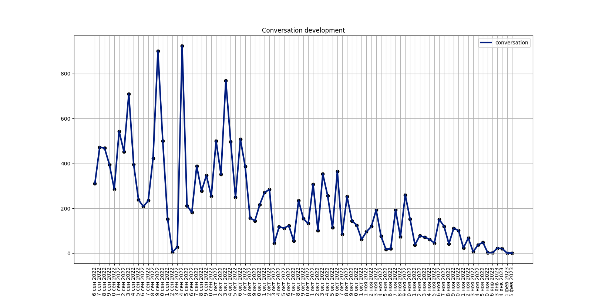
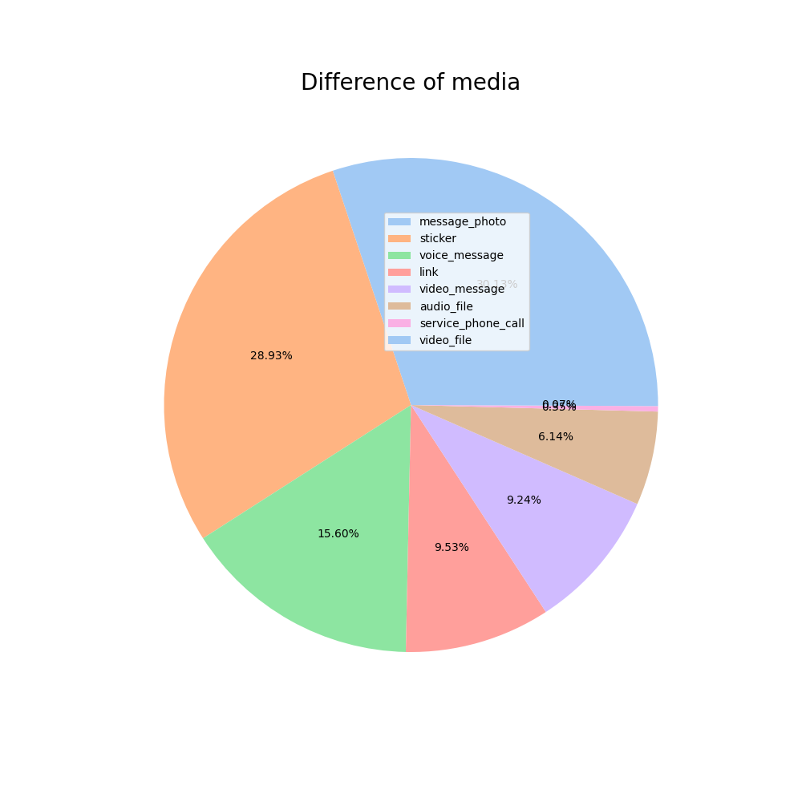

Проект реализует небольшой, но практичный и понятный интерфейс пользовательского
анализатора переписки в приложении телеграмм. Пользователь выгружает переписку в формате
json непосредственно из приложения и вставляет в корень программы. Далее из нее создается docx с резкльтами
анализа. Выгружать данные удобнее без фото/видеоконтента, только json с названием result.json

Тип и пример получаемой статистики:

1. Диаграмма вовлеченности 
2. Статистика по дням на каждого участника
3. Статистика по словам по дням
4. Общее развитие диалога 
5. Типы медиа 
6. Статистка по аудио 
7. Статистка по видео 
8. Статистика по стикерам 

Итог - файл док:

